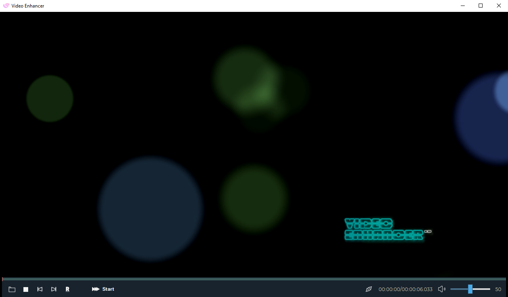
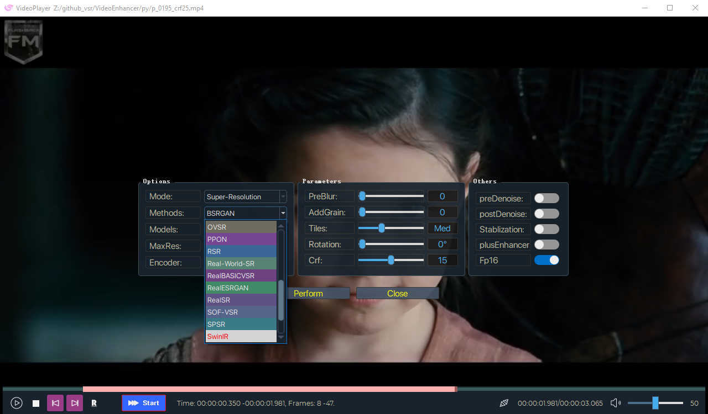
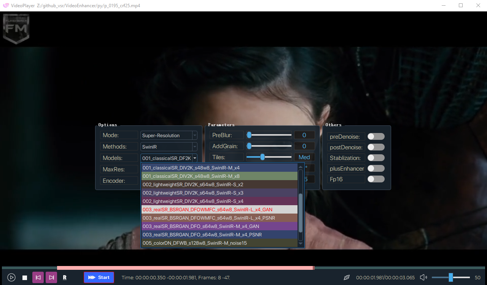
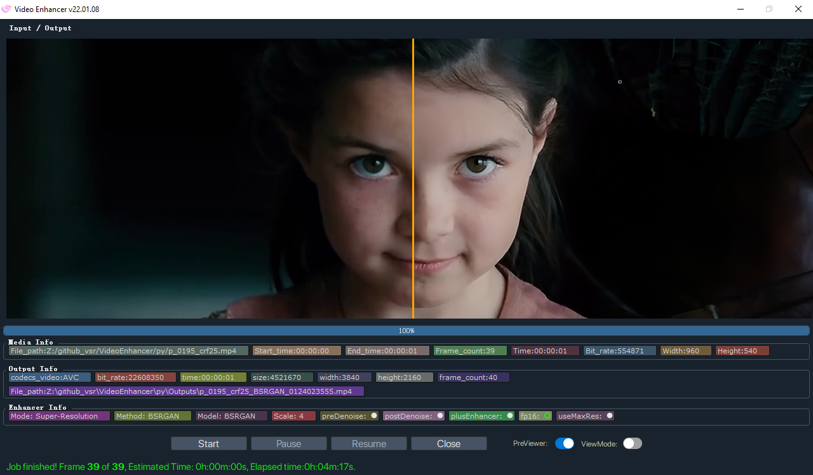
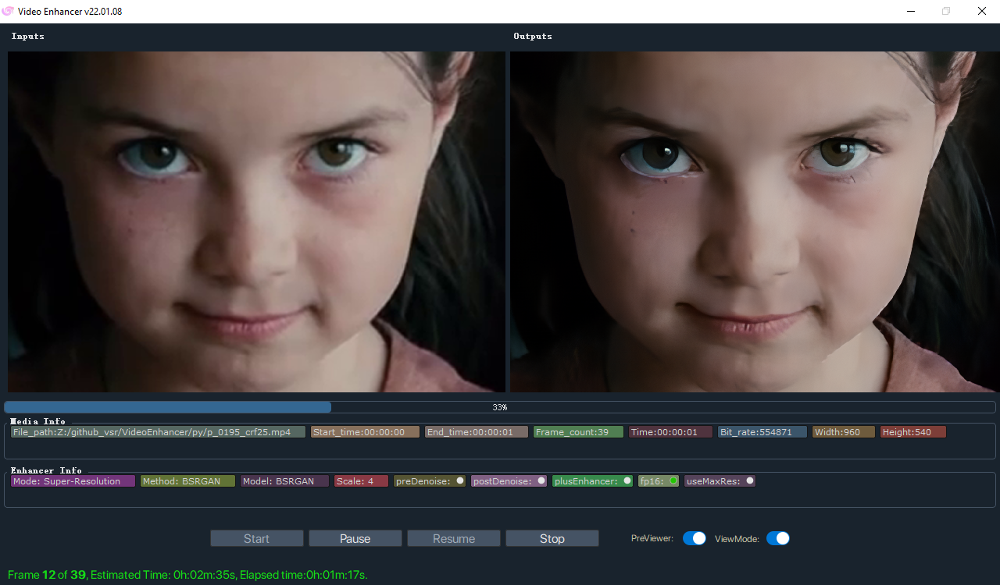

# VideoEnhancer
  

<pre><strong>This is an easy-to-use GUI tools for the open source video enhancement methods.
This tools just for learning and communication purposes only.</strong></pre>

## 1. User Interface 
  
  
  
  
  

## 2. Running Environment.

1. The runtime environment is cuda11.4 cudnn8.2.2, Please install and configure it.
2. [LAVFilters-0.75-x64](https://github.com/Nevcairiel/LAVFilters/releases) needs to be installed, please download from https://github.com/Nevcairiel/LAVFilters/releases.
3. To run the TRTEngine (.trt) and torch2trt (.pth) models, TensorRT 8.2.2.1 or higher is required. Because of trt model's device dependency, it needs to be converted by itself.
4. See the list of supported models, please refer to ckpts directory structure and download the pre-traind model to the corresponding directory by yourself.
5. Some additional features of the preview version have not been implemented yet, lack of testing and optimization, there may be a lot of bugs.

## 3. Quick start
1. Open the video file, set the processing range, select the method and model to perform the conversion.
2. Flexibly use the model customization function to block the list of uncommon models.
3. More model support and features are in the process of implementation.

## 4. Models.

#### The following models are currently supported, the pre-trained model needs to be downloaded from the official repositories.

 |  Method   | Repo   | Memo |
 |  ----  | ----  |----  |
 | TecoGAN | https://github.com/thunil/TecoGAN | Tensorflow |
 | COMISR |https://github.com/google-research/google-research/tree/master/comisr| . |
||||
 | DASR|https://github.com/The-Learning-And-Vision-Atelier-LAVA/DASR|SISR|
 | BSRGAN | https://github.com/cszn/BSRGAN |  |
 | RealESRGAN | https://github.com/xinntao/Real-ESRGAN | 
 | A-ESRGAN |https://github.com/aesrgan/A-ESRGAN | RealESRGAN |
 | SwinIR | https://github.com/JingyunLiang/SwinIR |  
 | ESRGAN | https://github.com/xinntao/ESRGAN |ESRGAN|
 | RSR | https://github.com/BCV-Uniandes/RSR |.|
 | Real-World-SR |  https://github.com/ManuelFritsche/real-world-sr |.|
 | RealSR |  https://github.com/jixiaozhong/RealSR |. |
 | BebyGAN |https://github.com/dvlab-research/Simple-SR | .|
 | ESRGANplus|https://github.com/ncarraz/ESRGANplus|. |
 | SPSR |  https://github.com/Maclory/SPSR | 
 | IMDN |  https://github.com/Zheng222/IMDN | |
 | PPON | https://github.com/Zheng222/PPON | |
 |||
 | BasicVSRPP  | https://github.com/open-mmlab/mmediting/tree/master/configs/restorers/basicvsr_plusplus | VSR |
 | D3Dnet|https://github.com/XinyiYing/D3Dnet|.|
 | IconVSR | https://github.com/open-mmlab/mmediting/blob/master/configs/restorers/iconvsr/README.md | .|
 | RealBasicVSR | https://github.com/ckkelvinchan/RealBasicVSR | . |
 | OVSR | https://github.com/psychopa4/OVSR | . |
 | TecoGAN-PyTorch |https://github.com/skycrapers/TecoGAN-PyTorch | . |
 | EGVSR | https://github.com/Thmen/EGVSR | . |
 | SOF-VSR | https://github.com/The-Learning-And-Vision-Atelier-LAVA/SOF-VSR | . |
 |||
 | *MuCAN |https://github.com/dvlab-research/Simple-SR | *inefficiency |
 | *VSR-Transformer | https://github.com/caojiezhang/VSR-Transformer | *|
 ||||
 |FastDVDnet |https://github.com/m-tassano/fastdvdnet|Video Denoise|
 ||||

 

<b>The ckpts directory structure</b> 

<b>Note:</b> Copy to the appropriate directory, otherwise it will not work properly. 
  <pre>
----ckpts\ 
    |----A-ESRGAN\
    |    |----A_ESRGAN_Multi.pth
    |    |----A_ESRGAN_Multi_Plus.pth
    |    |----A_ESRGAN_Single.pth
    |----BasicVSRPP\
    |    |----basicvsr_plusplus_c128n25_ntire_decompress_track1_20210223-7b2eba02.pth
    |    |----basicvsr_plusplus_c128n25_ntire_decompress_track2_20210314-eeae05e6.pth
    |    |----basicvsr_plusplus_c128n25_ntire_decompress_track3_20210304-6daf4a40.pth
    |    |----basicvsr_plusplus_c128n25_ntire_vsr_20210311-1ff35292.pth
    |    |----basicvsr_plusplus_c64n7_8x1_300k_vimeo90k_bd_20210305-ab315ab1.pth
    |    |----basicvsr_plusplus_c64n7_8x1_300k_vimeo90k_bi_20210305-4ef437e2.pth
    |    |----basicvsr_plusplus_c64n7_8x1_600k_reds4_20210217-db622b2f.pth
    |----BebyGAN\
    |    |----BebyGAN_x4.pth
    |----BSRGAN\
    |    |----BSRGAN.pth
    |    |----BSRGANx2.pth
    |----COMISR\
    |    |----model.ckpt.data-00000-of-00001
    |    |----model.ckpt.index
    |----D3Dnet\
    |    |----D3Dnet.pth.tar
    |----DASR\
    |    |----blindsr_x2_bicubic_iso\
    |    |    |----model\
    |    |    |    |----model_600.pt
    |    |----blindsr_x3_bicubic_iso\
    |    |    |----model\
    |    |    |    |----model_600.pt
    |    |----blindsr_x4_bicubic_aniso\
    |    |    |----model\
    |    |    |    |----model_600.pt
    |    |----blindsr_x4_bicubic_iso\
    |    |    |----model\
    |    |    |    |----model_600.pt
    |----EGVSR\
    |    |----EGVSR_iter420000.pth
    |----ESRGAN\
    |    |----4x-UltraSharp.pth
    |    |----ESRGAN_SRx4_DF2KOST_official-ff704c30.pth
    |    |----esrgan_x4c64b23g32_1x16_400k_div2k_20200508-f8ccaf3b.pth
    |    |----RRDB_ESRGAN_x4.pth
    |----ESRGANplus\
    |    |----nESRGANplus.pth
    |----FastDVDnet\
    |    |----model.pth
    |    |----model_clipped_noise.pth
    |----IconVSR\
    |    |----iconvsr_reds4_20210413-9e09d621.pth
    |    |----iconvsr_vimeo90k_bd_20210414-5f38cb34.pth
    |    |----iconvsr_vimeo90k_bi_20210413-7c7418dc.pth
    |----IMDN\
    |    |----IMDN_AS.pth
    |    |----IMDN_x2.pth
    |    |----IMDN_x3.pth
    |    |----IMDN_x4.pth
    |----MuCAN\
    |    |----MuCAN_REDS.pth
    |    |----MuCAN_Vimeo90K.pth
    |----OVSR\
    |    |----govsr_4+2_56.pth
    |    |----govsr_8+4_56.pth
    |    |----govsr_8+4_80.pth
    |    |----lovsr_4+2_56.pth
    |    |----lovsr_8+4_56.pth
    |    |----lovsr_8+4_80.pth
    |----PPON\
    |    |----PPON_G.pth
    |----Real-World-SR\
    |    |----AIM2019_SDSR.pth
    |    |----AIM2019_TDSR.pth
    |    |----DF2K_gaussian_SDSR.pth
    |    |----DF2K_gaussian_TDSR.pth
    |    |----DF2K_jpeg_SDSR.pth
    |    |----DF2K_jpeg_TDSR.pth
    |    |----DPED_SDSR.pth
    |    |----DPED_TDSR.pth
    |----RealBasicVSR\
    |    |----RealBasicVSR_x4.pth
    |----RealESRGAN\
    |    |----RealESRGANv2-animevideo-xsx2.pth
    |    |----RealESRGANv2-animevideo-xsx4.pth
    |    |----RealESRGAN_x2.pth
    |    |----RealESRGAN_x2plus.pth
    |    |----RealESRGAN_x4.pth
    |    |----RealESRGAN_x4plus.pth
    |    |----RealESRGAN_x4plus_anime_6B.pth
    |    |----RealESRGAN_x8.pth
    |----RealSR\
    |    |----DF2K.pth
    |    |----RealSR_DPED.pth
    |    |----RealSR_JPEG.pth
    |----RSR\
    |    |----RSR.pth
    |----SOF-VSR\
    |    |----ACCV\
    |    |    |----SOFVSR_x4.pth
    |    |----TIP\
    |    |    |----BD_x4.pth
    |    |    |----BI_x2.pth
    |    |    |----BI_x3.pth
    |    |    |----BI_x4.pth
    |----SPSR\
    |    |----spsr.pth
    |    |----spsr_1x.pth
    |    |----spsr_2x.pth
    |    |----spsr_8x.pth
    |----SPyNet\
    |    |----spynet_20210409-c6c1bd09.pth
    |----SwinIR\
    |    |----001_classicalSR_DF2K_s64w8_SwinIR-M_x2.pth
    |    |----001_classicalSR_DF2K_s64w8_SwinIR-M_x3.pth
    |    |----001_classicalSR_DF2K_s64w8_SwinIR-M_x4.pth
    |    |----001_classicalSR_DF2K_s64w8_SwinIR-M_x8.pth
    |    |----001_classicalSR_DIV2K_s48w8_SwinIR-M_x2.pth
    |    |----001_classicalSR_DIV2K_s48w8_SwinIR-M_x3.pth
    |    |----001_classicalSR_DIV2K_s48w8_SwinIR-M_x4.pth
    |    |----001_classicalSR_DIV2K_s48w8_SwinIR-M_x8.pth
    |    |----002_lightweightSR_DIV2K_s64w8_SwinIR-S_x2.pth
    |    |----002_lightweightSR_DIV2K_s64w8_SwinIR-S_x3.pth
    |    |----002_lightweightSR_DIV2K_s64w8_SwinIR-S_x4.pth
    |    |----003_realSR_BSRGAN_DFOWMFC_s64w8_SwinIR-L_x4_GAN.pth
    |    |----003_realSR_BSRGAN_DFOWMFC_s64w8_SwinIR-L_x4_PSNR.pth
    |    |----003_realSR_BSRGAN_DFO_s64w8_SwinIR-M_x4_GAN.pth
    |    |----003_realSR_BSRGAN_DFO_s64w8_SwinIR-M_x4_PSNR.pth
    |    |----005_colorDN_DFWB_s128w8_SwinIR-M_noise15.pth
    |    |----005_colorDN_DFWB_s128w8_SwinIR-M_noise25.pth
    |    |----005_colorDN_DFWB_s128w8_SwinIR-M_noise50.pth
    |----TecoGAN\
    |    |----TECOGAN.data-00000-of-00001
    |    |----TECOGAN.index
    |----TecoGAN-PyTorch\
    |    |----FRVSR_BD_iter400000.pth
    |    |----FRVSR_BI_iter400000.pth
    |    |----TecoGAN_2x_BD_REDS_iter500K.pth
    |    |----TecoGAN_4x_BD_REDS_iter500K.pth
    |    |----TecoGAN_4x_BD_Vimeo_iter500K.pth
    |    |----TecoGAN_4x_BI_Vimeo_iter500K.pth
    |    |----TecoGAN_BD_iter500000.pth
    |    |----TecoGAN_BI_iter500000.pth
    |----TrtEngine\
    |    |----BSRGAN_BSRGAN_360x360.trt
    |    |----real-esrgan_4xplus_360x360.trt
    |----TrtModule\
    |    |----BSRGAN_BSRGANx2_trt.pth
    |    |----BSRGAN_trt.pth
    |    |----ESRGAN_4x-UltraSharp_trt.pth
    |    |----RealESRGAN_RealESRGAN_x2plus_trt.pth
    |    |----RealESRGAN_RealESRGAN_x4plus_trt.pth
    |    |----RealESRGAN_RealESRGAN_x8_trt.pth
    |----vsrTransformer\
    |    |----vsrTransformer_reds_x4_final.pth
</pre>

You can find more ESRGAN models from [Model Database](https://upscale.wiki/wiki/Model_Database).
## 5. Update
1. VideoEnhancer Previewer v0.2.06 (2,432 MB) 
https://workupload.com/file/9jchpakjqNV passwd:km  
<pre>
 Changelogs:
    1. Complete the basic UI and processing framework. 
    2. Model management for hiding unused model libraries. 
    3. Adjustment UI, two preview modes are now available. 
    4. Optimise and remove a host of bugs. 
    5. Uniformity Styles. 
    6. TRTEngine Support. 
</pre>
## 6. Note
1. Thanks to all the open source authors this program references, if it is detrimental to your rights, 
please let me know and I will remove it as soon as possible.

2. The efficient is less than CLI , because of the GUI and the prevention of memory overflows. 

