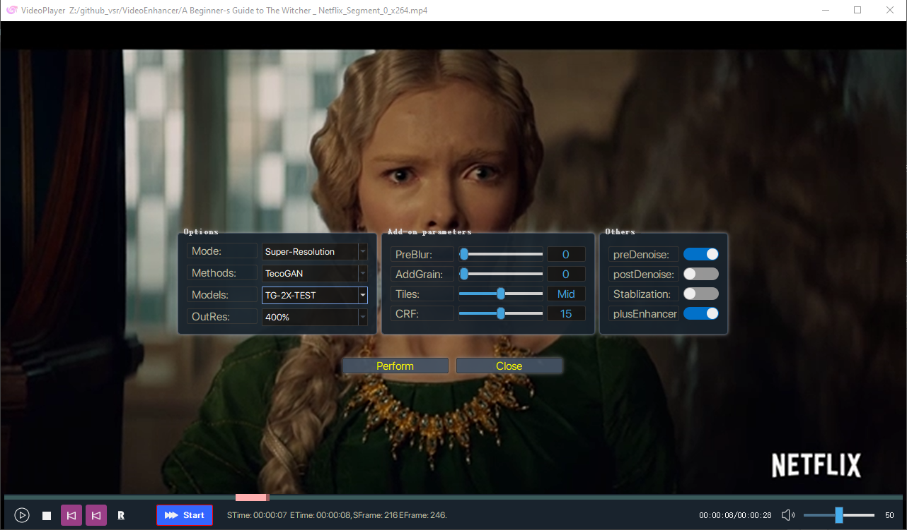
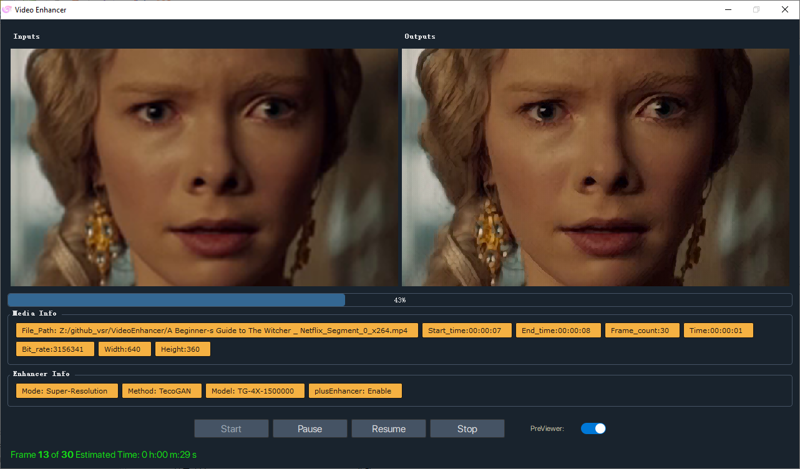
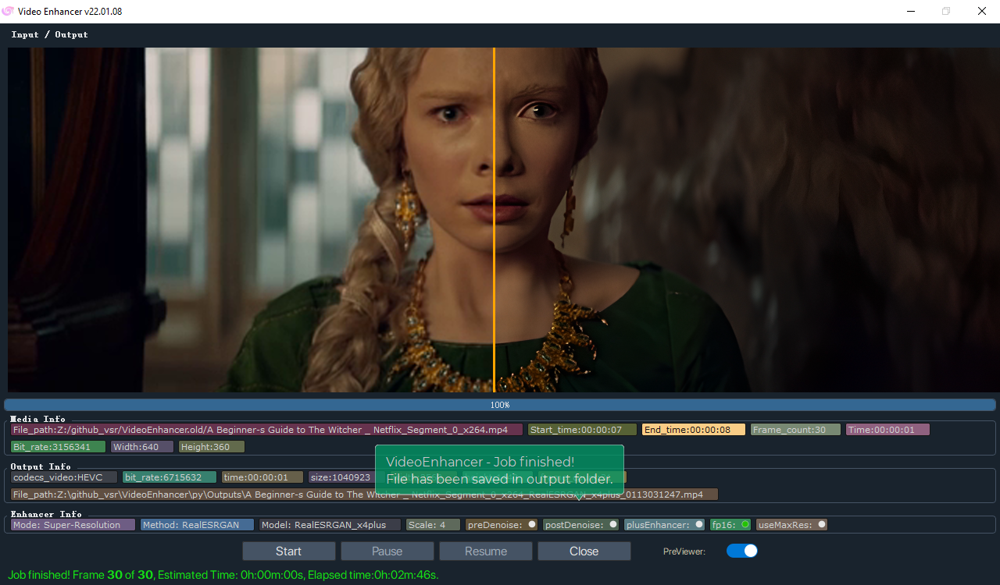
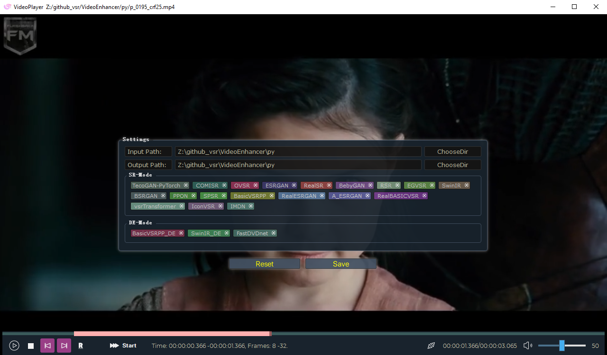

# VideoEnhancer
  

<pre><strong>This is an easy-to-use GUI tools for the open source video enhancement methods.This tools is completely free , 
Just for learning and communication purposes only.</strong></pre>

## 1. User Interface 
v1
  
  
v2
  
  
Method custom
  
## 2. Models.

#### The following models are currently supported, the pre-trained model needs to be downloaded from the official repositories.

 |  Method   | Repo   |
 |  ----  | ----  |
 | A-ESRGAN |https://github.com/aesrgan/A-ESRGAN | 
 | BSRGAN | https://github.com/cszn/BSRGAN |
 | BasicVSRPP  | https://github.com/open-mmlab/mmediting/tree/master/configs/restorers/basicvsr_plusplus |
 | BebyGAN |https://github.com/dvlab-research/Simple-SR | 
 | COMISR |https://github.com/google-research/google-research/tree/master/comisr|
 | EGVSR | https://github.com/Thmen/EGVSR | 
 | ESRGAN | https://github.com/xinntao/ESRGAN |
 | esrgan-tf2 | https://github.com/peteryuX/esrgan-tf2 | 
 | IMDN |  https://github.com/Zheng222/IMDN | 
 | IconVSR | https://github.com/open-mmlab/mmediting/blob/master/configs/restorers/iconvsr/README.md | 
 | OVSR | https://github.com/psychopa4/OVSR | 
 | PPON | https://github.com/Zheng222/PPON | 
 | RSR | https://github.com/BCV-Uniandes/RSR |
 | Real-World-SR |  https://github.com/ManuelFritsche/real-world-sr | 
 | RealBasicVSR | https://github.com/ckkelvinchan/RealBasicVSR | 
 | RealESRGAN | https://github.com/xinntao/Real-ESRGAN | 
 | RealSR |  https://github.com/jixiaozhong/RealSR | 
 | SPSR |  https://github.com/Maclory/SPSR | 
 | SwinIR | https://github.com/JingyunLiang/SwinIR |  
 | TecoGAN | https://github.com/thunil/TecoGAN | 
 | TecoGAN-PyTorch |https://github.com/skycrapers/TecoGAN-PyTorch |
 | VSR-Transformer | https://github.com/caojiezhang/VSR-Transformer | 
 | *MuCAN |https://github.com/dvlab-research/Simple-SR | 
 | |  |
 | * |  Memory Issues. |

 

<b>The ckpts directory structure</b> 

<b>Note:</b> Copy to the appropriate directory, otherwise it will not work properly. 
  <pre>
----ckpts\
    |----A-ESRGAN\
    |    |----A_ESRGAN_Multi.pth
    |    |----A_ESRGAN_Multi_Plus.pth
    |    |----A_ESRGAN_Single.pth
    |----BasicVSRPP\
    |    |----basicvsr_plusplus_c128n25_ntire_decompress_track1_20210223-7b2eba02.pth
    |    |----basicvsr_plusplus_c128n25_ntire_decompress_track2_20210314-eeae05e6.pth
    |    |----basicvsr_plusplus_c128n25_ntire_decompress_track3_20210304-6daf4a40.pth
    |    |----basicvsr_plusplus_c128n25_ntire_vsr_20210311-1ff35292.pth
    |    |----basicvsr_plusplus_c64n7_8x1_300k_vimeo90k_bd_20210305-ab315ab1.pth
    |    |----basicvsr_plusplus_c64n7_8x1_300k_vimeo90k_bi_20210305-4ef437e2.pth
    |    |----basicvsr_plusplus_c64n7_8x1_600k_reds4_20210217-db622b2f.pth
    |----BebyGAN\
    |    |----BebyGAN_x4.pth
    |----BSRGAN\
    |    |----BSRGAN.pth
    |    |----BSRGANx2.pth
    |    |----BSRNet.pth
    |----COMISR\
    |    |----model.ckpt.data-00000-of-00001
    |    |----model.ckpt.index
    |----EGVSR\
    |    |----EGVSR_iter420000.pth
    |----ESRGAN\
    |    |----1x_ArtClarity.pth
    |    |----1x_DEDITHER_32_512_126900_G.pth
    |    |----1x_PixelSharpen_v2.pth
    |    |----1x_Saiyajin_DeJPEG_300000_G.pth
    |    |----1x_SSAntiAlias9x.pth
    |    |----4x-UltraSharp.pth
    |    |----esrgan_psnr_x4c64b23g32_1x16_1000k_div2k_20200420-bf5c993c.pth
    |    |----ESRGAN_SRx4_DF2KOST_official-ff704c30.pth
    |    |----RRDB_ESRGAN_x4.pth
    |----FastDVDnet\
    |    |----model.pth
    |    |----model_clipped_noise.pth
    |----IconVSR\
    |    |----edvrm_reds_20210413-3867262f.pth
    |    |----edvrm_vimeo90k_20210413-e40e99a8.pth
    |    |----iconvsr_reds4_20210413-9e09d621.pth
    |    |----iconvsr_vimeo90k_bd_20210414-5f38cb34.pth
    |    |----iconvsr_vimeo90k_bi_20210413-7c7418dc.pth
    |----IMDN\
    |    |----IMDN_x2.pth
    |    |----IMDN_x3.pth
    |    |----IMDN_x4.pth
    |----MuCAN\
    |    |----MuCAN_REDS.pth
    |    |----MuCAN_Vimeo90K.pth
    |----OVSR\
    |    |----govsr_4+2_56.pth
    |    |----govsr_8+4_56.pth
    |    |----govsr_8+4_80.pth
    |    |----lovsr_4+2_56.pth
    |    |----lovsr_8+4_56.pth
    |    |----lovsr_8+4_80.pth
    |    |----ovsr_4x.pth
    |----PPON\
    |    |----PPON_G.pth
    |----RealBasicVSR\
    |    |----RealBasicVSR_x4.pth
    |----RealESRGAN\
    |    |----RealESRGANv2-animevideo-xsx2.pth
    |    |----RealESRGANv2-animevideo-xsx4.pth
    |    |----RealESRGAN_x2plus.pth
    |    |----RealESRGAN_x4plus.pth
    |    |----RealESRGAN_x4plus_anime_6B.pth
    |----RealSR\
    |    |----DF2K.pth
    |    |----RealSR_DPED.pth
    |    |----RealSR_JPEG.pth
    |----RSR\
    |    |----RSR.pth
    |----SPSR\
    |    |----spsr.pth
    |    |----spsr_1x.pth
    |    |----spsr_2x.pth
    |    |----spsr_8x.pth
    |----SPyNet\
    |    |----spynet_20210409-c6c1bd09.pth
    |----SwinIR\
    |    |----001_classicalSR_DF2K_s64w8_SwinIR-M_x2.pth
    |    |----001_classicalSR_DF2K_s64w8_SwinIR-M_x3.pth
    |    |----001_classicalSR_DF2K_s64w8_SwinIR-M_x4.pth
    |    |----001_classicalSR_DF2K_s64w8_SwinIR-M_x8.pth
    |    |----002_lightweightSR_DIV2K_s64w8_SwinIR-S_x2.pth
    |    |----002_lightweightSR_DIV2K_s64w8_SwinIR-S_x3.pth
    |    |----002_lightweightSR_DIV2K_s64w8_SwinIR-S_x4.pth
    |    |----003_realSR_BSRGAN_DFOWMFC_s64w8_SwinIR-L_x4_GAN.pth
    |    |----003_realSR_BSRGAN_DFO_s64w8_SwinIR-M_x4_GAN.pth
    |    |----005_colorDN_DFWB_s128w8_SwinIR-M_noise15.pth
    |    |----005_colorDN_DFWB_s128w8_SwinIR-M_noise25.pth
    |    |----005_colorDN_DFWB_s128w8_SwinIR-M_noise50.pth
    |----TecoGAN\
    |    |----TG-2X-TEST.data-00000-of-00001
    |    |----TG-2X-TEST.index
    |    |----TG-4X.data-00000-of-00001
    |    |----TG-4X.index
    |----TecoGAN-PyTorch\
    |    |----FRVSR_BD_iter400000.pth
    |    |----FRVSR_BI_iter400000.pth
    |    |----TecoGAN_2x_BD_REDS_iter500K.pth
    |    |----TecoGAN_4x_BD_REDS_iter500K.pth
    |    |----TecoGAN_4x_BD_Vimeo_iter500K.pth
    |    |----TecoGAN_4x_BI_Vimeo_iter500K.pth
    |    |----TecoGAN_BD_iter500000.pth
    |    |----TecoGAN_BI_iter500000.pth
    |----vsrTransformer\
    |    |----vsrTransformer_reds_x4_final.pth
</pre>

You can find more ESRGAN models from [Model Database](https://upscale.wiki/wiki/Model_Database).

## 3. Running Environment.

1. The runtime environment is cuda11.1 cudnn8.1.1, Please install and configure it.
2. [LAVFilters-0.75-x64](https://github.com/Nevcairiel/LAVFilters/releases).
3. FFMPEG support is required, copy ffmpeg.exe to the ffmpeg folder.

## 4. Changelogs
1. Complete the basic UI and processing framework. 20220107
2. Model management for hiding unused model libraries. 20220115
3. Adjustment UI, two preview modes are now available. 20220115
4. Optimise processing speed and remove a host of bugs. 20220115

## 5. Todo
  
## 6. Note
1. The execution is less efficient than the command line interface because of the GUI and the prevention of memory overflows. 
2. Thanks to all the open source authors this program references, if it is detrimental to your rights,  
please let me know and I will remove it as soon as possible.
